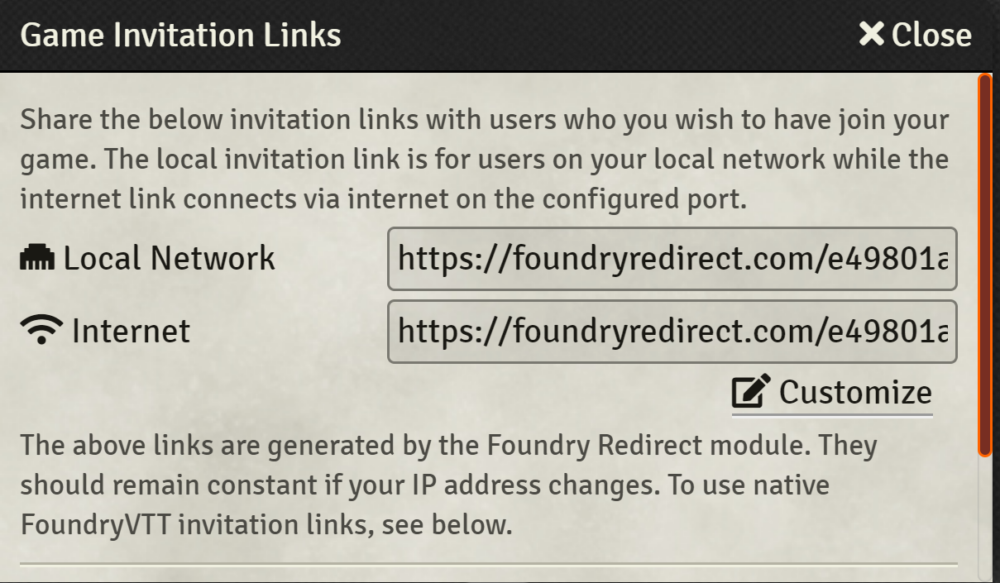

 

# Description
Foundry VTT module for converting the dynamic IP addresses Foundry VTT shows as invitation links to static URLs you can distribute to your players.

The generated links will continue to work even if your IP address changes! No more need to resend links every few weeks, you can bookmark a URL (which helpfully starts with "foundryredirect.com" so you wont forget what it is) and never worry about it again.

After install, Foundry Redirect will generate a URL for your world, and display it in the Invitation Links window.

Native Foundry VTT links will still be shown if you scroll, just in case you need them!

# Changelog

1.1.0
 - Update module description w/ security considerations and download numbers. 
 - Add support for Foundry 9

1.0.4 Updates to Github CI infrastructure. No functional changes

1.0.0 Initial Release

# License
MIT License

# Security Considerations

This module works by maintaining a database of Foundry IP addresses and the links which redirect to them, on AWS. Only the developer has access to the database.

However, if you are unconfortable the IP of your Foundry instance existing on a database outside of your control, the developer recommends against the use of this module.