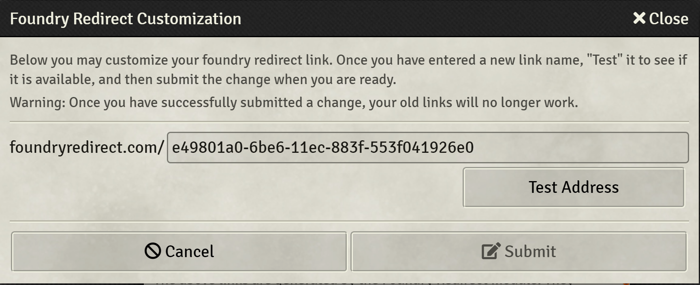
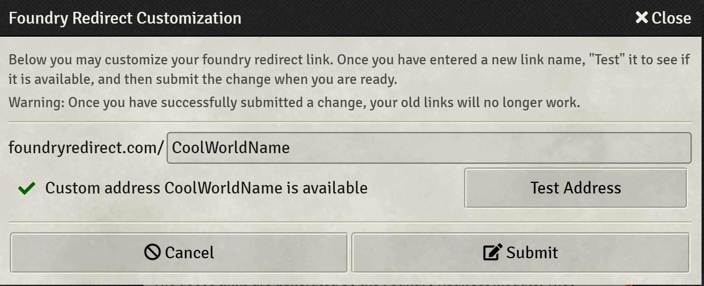

# Description
Foundry VTT module for converting the dynamic IP addresses Foundry VTT shows as invitation links to static URLs you can distribute to your players.

The generated links will continue to work even if your IP address changes! No more need to resend links every few weeks, you can bookmark a URL (which helpfully starts with "foundryredirect.com" so you wont forget what it is) and never worry about it again.

After install, Foundry Redirect will generate a URL for your world, and display it in the Invitation Links window.

Native Foundry VTT links will still be shown if you scroll, just in case you need them!

## Customizing Your Link

By default, Foundry Redirect will generate a link which looks like `https://foundryredirect.com/(a random ID)`. For example `https://foundryredirect.com/abcd1234-98gh-11zz-a976-611b200d4b84` This link will remain the same as your IP address changes, but is still unwieldy and difficult to memorize.

Instead of using the default random ID, you may customize it to something more unique to your world! From the Invitation Links window, click the "Customize" link to open the customization window. Then you can edit the link, "Test Address" to see if it is available, and Submit when you are happy with it

**Warning:** After customizing your link, your previous link will no longer work.

# Changelog

2.0.4
 - Update support to include Foundry v11
 - #20: Simplify acquisition of form element
 - Fix #19 : Remove deprecation warnings caused by change in manifest format for foundry v10

2.0.3
 - Fix #14 : Update version support to Foundry v10

2.0.2
 - Fix #11 : Update version support to be compatible with all v9 versions of Foundry

2.0.1
 - Foundry 9.245 support

2.0.0
 - Allow redirect address to be customized

1.1.0
 - Update module description w/ security considerations and download numbers.
 - Add support for Foundry 9

1.0.4 Updates to Github CI infrastructure. No functional changes

1.0.0 Initial Release

# License
MIT License

# Security Considerations

This module works by maintaining a database of Foundry IP addresses and the links which redirect to them, on AWS. Only the developer has access to the database.

However, if you are uncomfortable the IP of your Foundry instance existing on a database outside of your control, the developer recommends against the use of this module.
